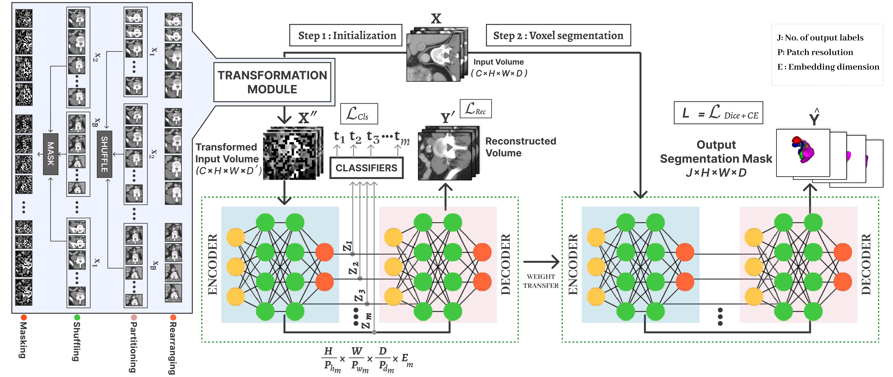

# **Learnable Weight Initialization for Volumetric Medical Image Segmentation**

[Shahina Kunhimon](https://github.com/ShahinaKK),
[Abdelrahman Shaker](https://scholar.google.com/citations?hl=en&user=eEz4Wu4AAAAJ),
[Muzammal Naseer](https://scholar.google.ch/citations?user=tM9xKA8AAAAJ&hl=en),
[Salman Khan](https://salman-h-khan.github.io),
and [Fahad Shahbaz Khan](https://scholar.google.es/citations?user=zvaeYnUAAAAJ&hl=en) 


> **Abstract:** *Hybrid volumetric medical image segmentation models, combining the advantages of local convolution and global attention, have recently received considerable attention. While mainly focusing on architectural modifications, most existing hybrid approaches still use conventional data-independent weight initialization schemes which restrict their performance due to ignoring the inherent volumetric nature of the medical data. To address this issue, we propose a learnable weight initialization approach that utilizes the available medical training data to effectively learn the contextual and structural cues via the proposed self-supervised objectives. Our approach is easy to integrate into any hybrid model and requires no external training data. Experiments on multi-organ and lung cancer segmentation tasks demonstrate the effectiveness of our approach, leading to state-of-the-art segmentation
performance.* 

<hr />


## Contents
1. [Highlights](#Highlights)
2. [Installation](#Installation)
3. [Dataset](#Dataset)
4. [Training](#Training)
5. [Results](#Results)
6. [Evaluation](#Evaluation)
7. [Contact](#Contact)
8. [References](#References)

<hr>


## Highlights

* We propose a learnable weight initialization method that can be integrated into any hybrid volumetric medical segmentation model.
* To learn such a weight initialization, we propose data-dependent self-supervised objectives tailored to learn the structural and contextual cues from the volumetric medical data.
* We demonstrate the effectiveness of our approach by conducting experiments for multi-organ and tumor segmentation tasks, achieving superior segmentation performance without requiring additional external training data.
  
<hr>

## Installation
1. Create and activate conda environment
```shell
conda create --name unetr_pp python=3.8
conda activate unetr_pp
```
2. Install PyTorch and torchvision
```shell
pip install torch==1.11.0+cu113 torchvision==0.12.0+cu113 --extra-index-url https://download.pytorch.org/whl/cu113
```
3. Install other dependencies
```shell
pip install -r requirements.txt
```
<hr>


## Dataset 
#### For UNETR training pipeline
 
1. Download the data [Synapse dataset](https://www.synapse.org/#!Synapse:syn3193805/wiki/217752)
2. Download the json file for training:validation data split [Synapse_split](https://drive.google.com/file/d/1n6uCL76NXRsZkWmjiUmNGy44uff7-MGf/view?usp=drive_link).
#### For UNETR++ training pipeline
1. Follow the instructions in [UNETR++](https://github.com/Amshaker/unetr_plus_plus) repo to download the preprocessed data and to organise the dataset folders.

<hr />


## Training
1. To train Synapse on UNETR using our proposed two stage framework: 
```shell
bash UNETR/init_train_test.sh init_run1
```
<hr />

2. To train Synapse on UNETR++ using our proposed two stage framework:
```shell
bash UNETR_PP/init_train_val_synapse.sh init_run1
```
<hr />


## Results


## Evaluation
### Synapse Dataset
##### <ins>UNETR (Ours)</ins>

Download the pretrained model weights for [Synapse_UNETR_Ours](https://drive.google.com/file/d/1vtAwX0yV39_IMQRqxK4KVA7RBfzErJMh/view?usp=drive_link) and paste ```Synapse_UNETR_Ours_final.pt``` in the path: ```UNETR/BTCV/pretrained_models/ ``` . Then, run 
```shell
python BTCV/test.py --infer_overlap=0.5 \
                    --pretrained_dir='./pretrained_models/' \
                    --pretrained_model_name=Synapse_UNETR_Ours_final.pt \
                    --saved_checkpoint=ckpt
```

##### <ins>UNETR++ (Ours)</ins>
Download the pretrained model weights for [Synapse_UNETR++ Ours](https://drive.google.com/drive/folders/1jEByRIKB1ZpjdGbTLCElx8v-RnL4gDnW?usp=drive_link) and paste ```model_final_checkpoint.model``` in the following path:
```shell
UNETR_PP/unetr_pp/evaluation/unetr_pp_ours_synapse_checkpoint/unetr_pp/3d_fullres/Task002_Synapse/unetr_pp_trainer_synapse__unetr_pp_Plansv2.1/fold_0/
```
Then, run 
```shell
bash evaluation_scripts/run_evaluation_synapse.sh init_run1
```

<!-- 3. To reproduce the results of UNETR++ (Ours) on Lung:
    Download [Decathlon-Lung UNETR++_Ours_weights](https://drive.google.com/file/d/12ICdIXXba6AOwTMBHxM604Vxm9QQZKiH/view?usp=drive_link) and paste ```model_final_checkpoint.model``` it in the following path:
```shell
UNETR_PP/unetr_pp/evaluation/unetr_pp_lung_checkpoint/unetr_pp/3d_fullres/Task006_Lung/unetr_pp_trainer_lung__unetr_pp_Plansv2.1/fold_0/
```
Then, run 
```shell
bash evaluation_scripts/run_evaluation_lung.sh init_run1
``` -->


## Contact

Should you have any questions, please create an issue in this repository or contact shahina.kunhimon@mbzuai.ac.ae
<hr>

## References

Our code is build on the repositories of [UNETR](https://github.com/Project-MONAI/research-contributions/tree/main/UNETR/BTCV) and [UNETR++](https://github.com/Amshaker/unetr_plus_plus). We thank them for releasing their code.

<hr>


